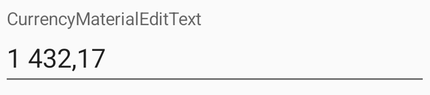

# CurrencyEditText


[](https://github.com/pravbeseda/CurrencyEditText/actions/workflows/ci.yml)
[](https://search.maven.org/search?q=g:%22ru.pravbeseda%22%20AND%20a:%22CurrencyEditText%22)

This library provides components `CurrencyTextEdit` and `CurrencyMaterialTextEdit` that can replace regular `TextEdit`. With built-in number formatting, these components are useful for entering monetary amounts and other numeric values.

 

**Library Features:**
* Support for formatting both by locale and by setting a separate group separator and decimal separator
* When entering a decimal point, the dot and comma buttons work the same way.
* Easily enter positive and negative values (just press minus regardless of cursor position)
* Optional currency symbol prefix
* Ability to set and get value as BigDecimal
* A simple way to define a validator and a changes listener
* The library is used in popular applications (see list in below)
* The author maintains and refines the library and is always happy to receive your comments and suggestions.

This project is fork of https://github.com/CottaCush/CurrencyEditText
Also there was used ideas of another project: https://github.com/firmfreez/CurrencyEditText
Thanks a lot to both authors.

## Gradle Dependency

Add the dependency to your app's `build.gradle`:

```groovy
implementation 'ru.pravbeseda:CurrencyEditText:<insert-latest-version-here>'
```

Requires `minSdk 24` (Android 7.0). Releases up to 1.1.1 support `minSdk 19`.

The artifact carries Kotlin 2.1 metadata and declares `kotlin-stdlib:2.1.0`, so a project
on Kotlin 2.1 or newer can consume it with nothing special in its own build; a newer
consumer keeps its own stdlib. Release 2.0.0 carries Kotlin 2.4 metadata and needs a 2.4
compiler.

For versions, kindly head over to
the [releases page](https://github.com/pravbeseda/CurrencyEditText/releases)

## Library content

There are 2 components in this library: `CurrencyEditText` and `CurrencyMaterialEditText`.
The `CurrencyMaterialEditText` component is inherited from `TextInputLayout` and is a wrapper
over `CurrencyEditText`.

## Usage

You can add the `CurrencyEditText` to your layout.

```xml
<ru.pravbeseda.currencyedittext.CurrencyEditText 
    android:layout_width="wrap_content"
    android:layout_height="60dp" 
    android:ems="10" 
    android:id="@+id/editText"
    android:text="1234.67"
    app:negativeValueAllow="true"
    app:maxNumberOfDecimalPlaces="2"
    app:decimalZerosPadding="false"
/>
```

Or you can use the `CurrencyMaterialEditText` component.

```xml
<ru.pravbeseda.currencyedittext.CurrencyMaterialEditText 
    android:layout_width="wrap_content"
    android:layout_height="60dp" 
    android:ems="10" 
    android:id="@+id/editText"
    app:text="1234.67"
    app:negativeValueAllow="true"
    app:maxNumberOfDecimalPlaces="2"
    app:decimalZerosPadding="false"
/>
```

That's all for basic setup. Your `editText` should automatically format currency inputs.

After that, you can configure the View parameters separately in the code:

```Kotlin
edittext.setNegativeValueAllow(true)
edittext.setMaxNumberOfDecimalPlaces(2)
edittext.setDecimalZerosPadding(true)
```

You can set the value via `setValue` method:

```Kotlin
edittext.setValue(BigDecimal(4321.76))
val value = edittext.getValue()
```

`getValue` always returns a number: an empty field reads as `BigDecimal.ZERO`.

Or you can set the text value directly:

```Kotlin
edittext.setText("4321.76")
```

But in the last case the value is needed to be formatted according to CurrencyEditText localization settings.

You can set value validation:

```Kotlin
edittext.setValidator { value ->
    var error = ""
    if (value < BigDecimal(1000)) {
        error = "Value is less than 1000"
    }
    error
}
```


You can check the current state of the field via `isValid` property or `isValidState()` method

```Kotlin
if (edittext.isValid) {
    // do something
}
```

If you need to revalidate an unchanged field, call the `validate()` method:

```Kotlin
edittext.validate()
```

You can subscribe to a field value change event:

```Kotlin
edittext.onValueChanged { bigDecimal, state: State, textError: String ->
    if (state !== State.ERROR) {
        textView.text = bigDecimal.toString()
    } else {
        textView.text = textError
    }
}
```

In the CurrencyMaterialEditText component, the validation error text is shown automatically.

## Calculator

Both components can show a calculator button at the end of the field. It is off by default:

```
app:calculatorEnabled="true"
```

Or in the code:

```Kotlin
edittext.setCalculatorEnabled(true)
```

Tapping the button opens a panel under the field, seeded with the field's current value. It
evaluates a full expression — `+ - x /`, parentheses, and a sign key that flips the operand being
entered — and `=` writes the result back into the field, rounded to `maxNumberOfDecimalPlaces`. An
expression that does not evaluate, divides by zero, or comes out negative in a field with
`negativeValueAllow="false"` leaves the field untouched. The system keyboard is not replaced: the
field still takes typed input as before.

On `CurrencyEditText` the button is drawn as a compound drawable and opens on a tap on the icon, so
it is not a separate node for a screen reader. Where that matters, use `CurrencyMaterialEditText`:
there the button is a real end icon with a content description.

### Panel colors

The panel takes its colors from the host app's theme and needs no configuration. Where the defaults
are not what you want, point `currencyCalculatorStyle` at a style of your own — on the app theme, or
on the `android:theme` overlay of a single field, which gives that one field its own panel:

```xml
<style name="AppTheme" parent="Theme.Material3.DayNight">
    <item name="currencyCalculatorStyle">@style/MyCalculator</item>
</style>

<style name="MyCalculator" parent="">
    <item name="calculatorPanelBackgroundColor">@color/panel</item>
    <item name="calculatorOperatorTextColor">?attr/colorPrimary</item>
</style>
```

Name only the roles you want changed; the rest keep their defaults.

| Attribute | What it paints | Default |
|---|---|---|
| `calculatorPanelBackgroundColor` | the panel behind the keys | `?android:attr/colorBackground` |
| `calculatorExpressionTextColor` | the expression line | `?android:attr/textColorPrimary` |
| `calculatorErrorTextColor` | the expression line when it does not evaluate | `#B00020` |
| `calculatorKeyTextColor` | the digits and the decimal separator | `?android:attr/textColorPrimary` |
| `calculatorOperatorTextColor` | operators, sign, backspace, clear and equals | `?attr/colorPrimary`, dimmed when a key is disabled |

## Localization

The library supports localization. You can set the locale in the layout file:

```
app:localeTag="da-DK"
```

Or in the code:

```Kotlin
edittext.setLocale(Locale("da", "DK"))
// or
edittext.setLocale(Locale.GERMAN)
// or
edittext.setLocale("da-DK")
```

You can just set the decimal and grouping separators:

```
app:decimalSeparator=","
app:groupingSeparator=" "
```

Or in the code:

```Kotlin
edittext.setSeparators(' ', ',')
```

## CurrencyMaterialEditText Features

Since CurrencyMaterialEditText is not a descendant of EditText, some EditText properties are passed with the prefix 'app'. For example:

```
app:text="1234.67"
app:selectAllOnFocus="true"
```

Some properties are only available for the CurrencyMaterialEditText component.

You can set hint (label):
```
android:hint="Account amount"
```

Or in the code:

```Kotlin
currencyMaterialEditText.hint = "Account amount"
```

As mentioned above, the validation error text in the CurrencyMaterialEditText component is shown automatically.

## Usage of the library

The library is used in applications:

1. [How much can I spend?](https://play.google.com/store/apps/details?id=pravbeseda.spendcontrol)
2. [How much can I spend? Premium](https://play.google.com/store/apps/details?id=pravbeseda.spendcontrol.premium)

If you have used the library in your project, please send me a link to the project. I will be happy to include it in this list.

## License

    Copyright (c) 2022-2023 Alexander Ivanov

    Licensed under the Apache License, Version 2.0 (the "License");
    you may not use this file except in compliance with the License.
    You may obtain a copy of the License at

       http://www.apache.org/licenses/LICENSE-2.0

    Unless required by applicable law or agreed to in writing, software
    distributed under the License is distributed on an "AS IS" BASIS,
    WITHOUT WARRANTIES OR CONDITIONS OF ANY KIND, either express or implied.
    See the License for the specific language governing permissions and
    limitations under the License.
