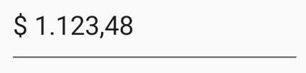
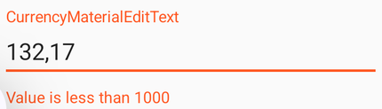

# CurrencyEditText

[](https://github.com/pravbeseda/CurrencyEditText/actions/workflows/ci.yml)
[](https://central.sonatype.com/artifact/ru.pravbeseda/CurrencyEditText)

**Maven Central:** https://central.sonatype.com/artifact/ru.pravbeseda/CurrencyEditText

This library provides components `CurrencyEditText` and `CurrencyMaterialEditText` that can replace
a regular `EditText`. With built-in number formatting, these components are useful for entering
monetary amounts and other numeric values.

 

**Library features:**
* Support for formatting both by locale and by setting a separate grouping separator and decimal separator
* When entering a decimal point, the dot and comma buttons work the same way
* Easily enter positive and negative values (just press minus regardless of cursor position)
* Optional currency symbol prefix
* Ability to set and get the value as `BigDecimal`
* A simple way to define a validator and a change listener
* An opt-in calculator panel under the field
* The library is used in popular applications (see the list below)
* The author maintains and refines the library and is always happy to receive your comments and suggestions

## Contents

* [Installation](#installation)
* [Components](#components)
* [Quick start](#quick-start)
* [Reading and writing the value](#reading-and-writing-the-value)
* [XML attributes](#xml-attributes)
* [Currency symbol](#currency-symbol)
* [Localization](#localization)
* [Validation and change events](#validation-and-change-events)
* [Calculator](#calculator)
* [Formatting outside the view](#formatting-outside-the-view)
* [CurrencyMaterialEditText specifics](#currencymaterialedittext-specifics)
* [Usage of the library](#usage-of-the-library)
* [Credits](#credits)
* [License](#license)

## Installation

Add the dependency to your app's `build.gradle`:

```groovy
implementation 'ru.pravbeseda:CurrencyEditText:<insert-latest-version-here>'
```

The latest version is on
the [Maven Central page](https://central.sonatype.com/artifact/ru.pravbeseda/CurrencyEditText); the
changes behind it are on
the [releases page](https://github.com/pravbeseda/CurrencyEditText/releases).

Requires `minSdk 24` (Android 7.0). Releases up to 1.1.1 support `minSdk 19`.

Since 2.0.1 the artifact carries Kotlin 2.1 metadata and declares `kotlin-stdlib:2.1.0`, so a
project on Kotlin 2.1 or newer can consume it with nothing special in its own build; a newer
consumer keeps its own stdlib. Release 2.0.0 carries Kotlin 2.4 metadata and needs a 2.4 compiler.

## Components

There are 2 components in this library: `CurrencyEditText` and `CurrencyMaterialEditText`.

| | `CurrencyEditText` | `CurrencyMaterialEditText` |
|---|---|---|
| Extends | `AppCompatEditText` | `TextInputLayout`, wrapping a `CurrencyEditText` |
| Hint | `android:hint` on the field | floating label of `TextInputLayout` |
| Validation error | delivered to your `onValueChanged` listener | shown by the layout automatically |
| Calculator button | compound drawable, no separate accessibility node | real end icon with a content description |
| `EditText` attributes | used directly | some are passed with the `app` prefix (see [below](#currencymaterialedittext-specifics)) |

## Quick start

Add the `CurrencyEditText` to your layout:

```xml
<ru.pravbeseda.currencyedittext.CurrencyEditText
    android:layout_width="wrap_content"
    android:layout_height="60dp"
    android:ems="10"
    android:id="@+id/editText"
    android:text="1234.67"
    app:negativeValueAllow="true"
    app:maxNumberOfDecimalPlaces="2"
    app:decimalZerosPadding="false"
/>
```

Or use the `CurrencyMaterialEditText` component:

```xml
<ru.pravbeseda.currencyedittext.CurrencyMaterialEditText
    android:layout_width="wrap_content"
    android:layout_height="60dp"
    android:ems="10"
    android:id="@+id/editText"
    app:text="1234.67"
    app:negativeValueAllow="true"
    app:maxNumberOfDecimalPlaces="2"
    app:decimalZerosPadding="false"
/>
```

That's all for the basic setup. Your `editText` should automatically format currency inputs.

The same settings can be applied in code:

```Kotlin
editText.setNegativeValueAllow(true)
editText.setMaxNumberOfDecimalPlaces(2)
editText.setDecimalZerosPadding(true)
```

## Reading and writing the value

```Kotlin
editText.setValue(BigDecimal("4321.76"))
val value = editText.getValue()
```

`getValue` always returns a number: an empty field reads as `BigDecimal.ZERO`. In Kotlin the same
pair is available as the `value` property:

```Kotlin
editText.value = BigDecimal("4321.76")
```

Or you can set the text value directly:

```Kotlin
editText.setText("4321.76")
```

But in the last case the value needs to be formatted according to the localization settings of the
component.

## XML attributes

Both components accept these attributes:

| Attribute | Type | Default | What it does |
|---|---|---|---|
| `localeTag` | string | the system locale | separators of the given locale, e.g. `da-DK` |
| `decimalSeparator` | string | from the locale | the decimal separator; set together with `groupingSeparator` |
| `groupingSeparator` | string | from the locale | the thousands separator; set together with `decimalSeparator` |
| `maxNumberOfDecimalPlaces` | integer | `2` | digits allowed after the decimal separator |
| `decimalZerosPadding` | boolean | `false` | pad the fractional part with zeros up to that number |
| `negativeValueAllow` | boolean | `false` | allow negative values |
| `emptyStringForZero` | boolean | `true` | show an empty field instead of `0` |
| `currencySymbol` | string | none | prefix in front of the number, e.g. `$` |
| `useCurrencySymbolAsHint` | boolean | `false` | show that prefix as the hint of an empty field |
| `calculatorEnabled` | boolean | `false` | show the calculator button (see [Calculator](#calculator)) |

`CurrencyMaterialEditText` accepts two more, `text` and `selectAllOnFocus` — see
[CurrencyMaterialEditText specifics](#currencymaterialedittext-specifics).

> `currencySymbol` and `useCurrencySymbolAsHint` are read by `CurrencyEditText` only; on
> `CurrencyMaterialEditText` they are currently ignored
> ([issue #44](https://github.com/pravbeseda/CurrencyEditText/issues/44)).

## Currency symbol

A `CurrencyEditText` can show a symbol in front of the number:

```xml
app:currencySymbol="$"
app:useCurrencySymbolAsHint="true"
```

Or in the code:

```Kotlin
editText.setCurrencySymbol("$", useCurrencySymbolAsHint = true)
```

The symbol is kept as a prefix with a trailing space (`"$ "`) and is part of the field text; the
value read by `getValue` never contains it.

## Localization

The library supports localization. You can set the locale in the layout file:

```xml
app:localeTag="da-DK"
```

Or in the code:

```Kotlin
editText.setLocale(Locale("da", "DK"))
// or
editText.setLocale(Locale.GERMAN)
// or
editText.setLocale("da-DK")
```

You can just set the decimal and grouping separators:

```xml
app:decimalSeparator=","
app:groupingSeparator=" "
```

Or in the code:

```Kotlin
editText.setSeparators(' ', ',')
```

## Validation and change events

You can set value validation:

```Kotlin
editText.setValidator { value ->
    var error = ""
    if (value < BigDecimal(1000)) {
        error = "Value is less than 1000"
    }
    error
}
```



You can check the current state of the field via the `isValid` property or the `isValidState()`
method:

```Kotlin
if (editText.isValid) {
    // do something
}
```

If you need to revalidate an unchanged field, call the `validate()` method:

```Kotlin
editText.validate()
```

You can subscribe to a field value change event:

```Kotlin
editText.onValueChanged { bigDecimal, state: State, textError: String ->
    if (state !== State.ERROR) {
        textView.text = bigDecimal.toString()
    } else {
        textView.text = textError
    }
}
```

In the `CurrencyMaterialEditText` component, the validation error text is shown automatically.

## Calculator

Both components can show a calculator button at the end of the field. It is off by default:

```xml
app:calculatorEnabled="true"
```

Or in the code:

```Kotlin
editText.setCalculatorEnabled(true)
```

Tapping the button opens a panel under the field, seeded with the field's current value. It
evaluates a full expression — `+ - x /`, parentheses, and a sign key that flips the operand being
entered — and `=` writes the result back into the field, rounded to `maxNumberOfDecimalPlaces`. An
expression that does not evaluate, divides by zero, or comes out negative in a field with
`negativeValueAllow="false"` leaves the field untouched. The system keyboard is not replaced: the
field still takes typed input as before.

On `CurrencyEditText` the button is drawn as a compound drawable and opens on a tap on the icon, so
it is not a separate node for a screen reader. Where that matters, use `CurrencyMaterialEditText`:
there the button is a real end icon with a content description.

### Panel colors

The panel takes its colors from the host app's theme and needs no configuration. Where the defaults
are not what you want, point `currencyCalculatorStyle` at a style of your own — on the app theme, or
on the `android:theme` overlay of a single field, which gives that one field its own panel:

```xml
<style name="AppTheme" parent="Theme.Material3.DayNight">
    <item name="currencyCalculatorStyle">@style/MyCalculator</item>
</style>

<style name="MyCalculator" parent="">
    <item name="calculatorPanelBackgroundColor">@color/panel</item>
    <item name="calculatorOperatorTextColor">?attr/colorPrimary</item>
</style>
```

Name only the roles you want changed; the rest keep their defaults.

| Attribute | What it paints | Default |
|---|---|---|
| `calculatorPanelBackgroundColor` | the panel behind the keys | `?android:attr/colorBackground` |
| `calculatorExpressionTextColor` | the expression line | `?android:attr/textColorPrimary` |
| `calculatorErrorTextColor` | the expression line when it does not evaluate | `#B00020` |
| `calculatorKeyTextColor` | the digits and the decimal separator | `?android:attr/textColorPrimary` |
| `calculatorOperatorTextColor` | operators, sign, backspace, clear and equals | `?attr/colorPrimary`, dimmed when a key is disabled |

## Formatting outside the view

The same formatting is available without a view — for a label, a report or a summary line:

```Kotlin
Routines.bigDecimalToString(
    BigDecimal("1234.5"),
    CurrencyFormatConfig(
        decimalSeparator = ',',
        groupingSeparator = ' ',
        decimalLength = 2,
        showPlusSign = false,
        addLTRPrefix = false,
    ),
) // "1 234,50"
```

`CurrencyFormatConfig` defaults to the separators of the default locale and `decimalLength = 2`.
Pass `emptyChar` as `groupingSeparator` to format without a thousands separator, `showPlusSign` to
mark positive values with a `+`, and `addLTRPrefix` to prepend the LTR mark needed in right-to-left
locales.

## CurrencyMaterialEditText specifics

Since `CurrencyMaterialEditText` is not a descendant of `EditText`, some `EditText` properties are
passed with the `app` prefix. For example:

```xml
app:text="1234.67"
app:selectAllOnFocus="true"
```

You can set the hint (label):

```xml
android:hint="Account amount"
```

Or in the code:

```Kotlin
currencyMaterialEditText.hint = "Account amount"
```

As mentioned above, the validation error text in the `CurrencyMaterialEditText` component is shown
automatically.

## Usage of the library

The library is used in applications:

1. [How much can I spend?](https://play.google.com/store/apps/details?id=pravbeseda.spendcontrol)
2. [How much can I spend? Premium](https://play.google.com/store/apps/details?id=pravbeseda.spendcontrol.premium)

If you have used the library in your project, please send me a link to the project. I will be happy
to include it in this list.

## Credits

This project is a fork of https://github.com/CottaCush/CurrencyEditText.  
Ideas from https://github.com/firmfreez/CurrencyEditText were also used.  
Thanks a lot to both authors.

## License

    Copyright (c) 2022-2023 Alexander Ivanov

    Licensed under the Apache License, Version 2.0 (the "License");
    you may not use this file except in compliance with the License.
    You may obtain a copy of the License at

       http://www.apache.org/licenses/LICENSE-2.0

    Unless required by applicable law or agreed to in writing, software
    distributed under the License is distributed on an "AS IS" BASIS,
    WITHOUT WARRANTIES OR CONDITIONS OF ANY KIND, either express or implied.
    See the License for the specific language governing permissions and
    limitations under the License.
